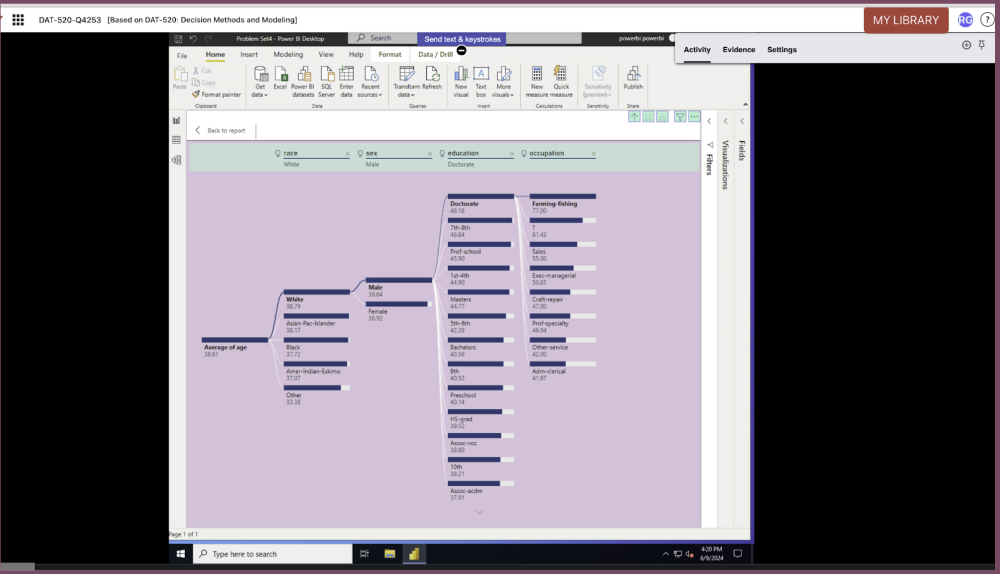
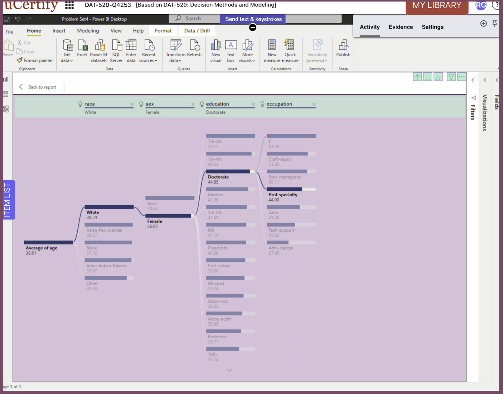
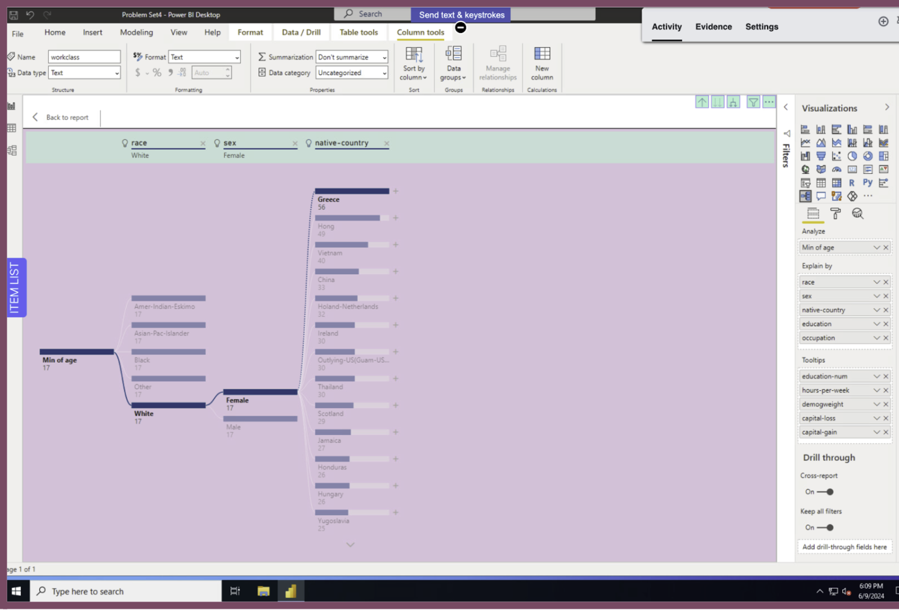
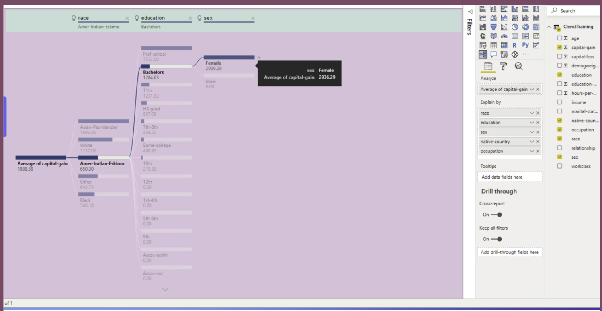

# Decomposition Trees in Power BI (Lab 6.1)

> **Course Module:** Four  
> **Tooling:** Power BI Desktop (Decomposition Tree visual)  
> **Deliverable:** Markdown README with embedded screenshots (no PDFs)

---

## Overview
In Module Four, we shift from **bottom-up** models to **top-down** models. The goal of this lab is to introduce the methodology of **decision / decomposition analysis** and demonstrate how to interpret results. Using Power BI’s **Decomposition Tree** visual, I explored how different demographic and socioeconomic variables (race, sex, education, occupation, native country) affect metrics such as **average age** and **capital gains**.

---

## Key Findings
- **Overall average age** in the dataset was **38.61 years**.  
- **Males** showed a much higher average (**44.33 years**) than females.  
- **Males with some college** also averaged **44.33 years**, showing education alone did not shift their age distribution in this slice.  
- **Males in tech support** skewed younger (**37.26 years**).  
- **Asian Pacific Islander males** averaged **38.17 years**, closer to the global mean.  
- When filtering for **White females with a doctorate working in professional-specialty roles**, the decomposition tree narrowed down to small subgroups with unique age averages.  
- **Capital gains** analysis revealed significant variation across race/education subgroups. For example, *American Indian–Eskimo females with a bachelor’s degree* showed distinct averages that diverged from broader population trends.  
- Using **Minimum Age** as the metric revealed the dataset contained individuals as young as **17 years**, and narrowing filters highlighted how quickly extreme values can change with smaller populations.

> These findings highlight the decomposition tree’s strength: it allows for **interactive subgroup discovery**, showing how metrics change as filters refine the dataset.

---

## What I learned
- How to build and interpret a **Decomposition Tree** in Power BI  
- Configure **Analyze** (metric) vs **Explain By** (dimensions) fields  
- Use **AI Split** to suggest statistically strongest next splits  
- Apply interactive **filters/slicers** and observe how metrics shift  
- Translate **numerical results into insights** for decision-making  

---

## Instructions on how to reproduce
1. Open the **uCertify Lab 6.1 – Decomposition Trees in Power BI** environment.  
2. In Power BI Desktop:  
   - Add the **Decomposition Tree** visual.  
   - Set *Analyze* metric (e.g., **Average Age**, **Minimum Age**, or **Average of Capital Gains**).  
   - Add categorical fields to *Explain By* (e.g., **Race**, **Sex**, **Education**, **Occupation**, **Native Country**).  
3. Expand nodes by clicking a **+** sign; use **AI Split** to test strongest splits.  
4. Apply filters/slicers (sex, occupation, education) and watch metrics change.  
5. Capture screenshots and note subgroup findings (examples below).  

---

## Screenshots & Results

### 1) New Decision Tree (overview)
**Overall finding:** The **global average age** of the dataset is **38.61 years**.  
This becomes the baseline for subsequent splits.

---

### 2) Average Age with current selections
**Answer:** **38.61 years**  
This confirms the **overall dataset mean age** prior to subgrouping.

---

### 3) Filtered Tree (specific inputs)
**Selections:**  
- Weighted % White  
- Female  
- Occupation: Prof-specialty  
- Education: Doctorate  

**Finding:** Narrowing down to this highly specific subgroup produced **different averages** from the global baseline. This demonstrated how **filters isolate small populations**, and why their metrics diverge significantly from overall averages.

---

### 4) Why do the numbers change?
Each new filter changes the **subset of the dataset being analyzed**. Power BI recalculates the metric (e.g., average age) for that smaller subgroup, so values naturally differ. This shows why decomposition trees are powerful: they dynamically reveal **context-sensitive metrics**.

---

## 5) Three Trees with Findings (A, B, C)

### A) Minimum Age focus (White Females)
- **Metric:** Minimum Age  
- **Result:** Dataset contained individuals as young as **17 years**.  
- **Insight:** Filtering by *White females* retained that minimum, showing the distribution of young participants within this subgroup.

---

### B) Average of Capital Gains (American Indian–Eskimo, Bachelor’s, Female)
- **Metric:** Average of Capital Gains  
- **Finding:** This subgroup showed distinct capital gain averages that diverged from the general dataset.  
- **Insight:** Race and education together create sharper differences than sex alone. The tree highlights how **economic outcomes** are not evenly distributed across groups.

---

### C) Average Age by Sex, Education, Occupation, Ethnicity
- **Metric:** Average Age  
- **Findings:**  
  - Overall: **38.61 years**  
  - Males overall: **44.33 years**  
  - Males with some college: **44.33 years**  
  - Males in tech support: **37.26 years**  
  - Asian Pacific Islander males: **38.17 years**  
- **Insight:** Occupation and ethnicity shifts reveal meaningful subgroup differences, with some groups aligning to the global mean while others skew higher or lower.

---

## Key Skills Demonstrated
- Creating and interpreting **Decomposition Trees**  
- Comparing **aggregate vs subgroup metrics** (average vs minimum vs capital gains)  
- Using **AI Split** and manual filtering  
- Applying multiple **slicers** simultaneously  
- Capturing and **documenting findings** with reproducible screenshots  
- Translating raw numbers into **decision-making insights**  

---

## Repo Description
Lab 6.1: Decomposition Trees in Power BI. Interactive analysis of demographic and socioeconomic subgroups using decomposition trees. Findings include baseline averages, subgroup variations, and capital gains insights, with detailed screenshots and explanations.

---
