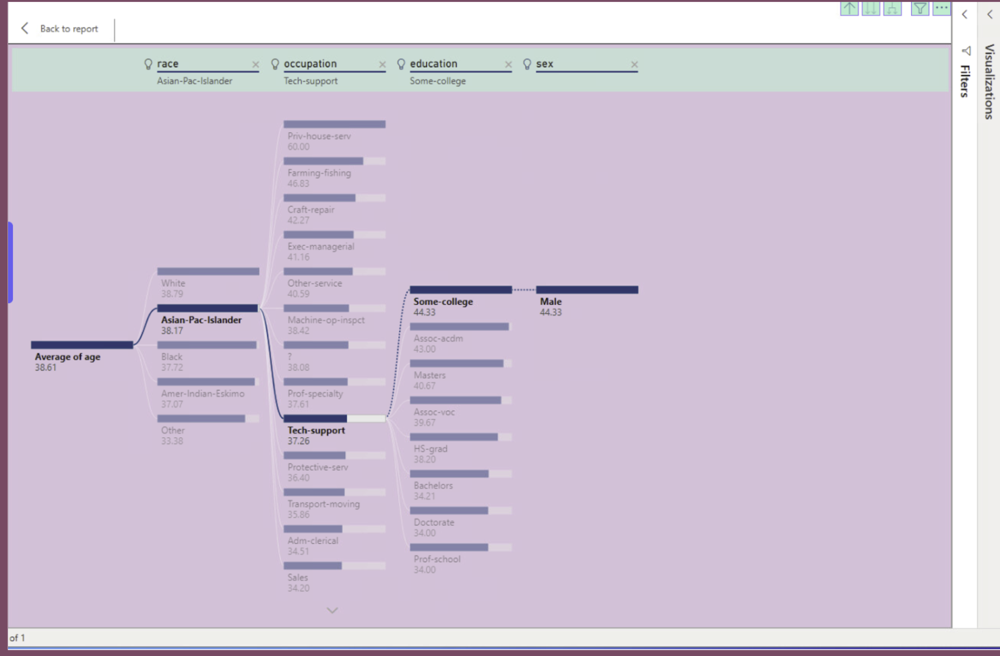

# Decomposition Trees in Power BI (Lab 6.1)

> **Course Module:** Four  
> **Tooling:** Power BI Desktop (Decomposition Tree visual)  
> **Deliverable:** Markdown README with embedded screenshots (no PDFs)

---

## Overview
In Module Four, you shift from **bottom-up** models to **top-down** models. The goal of this lab is to introduce the methodology of **decision / decomposition analysis** and teach you how to read decision trees and answer questions about them. Conditional probabilities and split recommendations can be generated by the visual—just point and click.

> **Tip:** You can view the entire tree by clicking and **dragging** the visual left ↔ right as needed. If you alter the dashboard layout to the point that it’s no longer useful while practicing, simply **close without saving** and reopen to restore defaults.

---

## What you’ll learn
- Build and interpret a **Decomposition Tree** in Power BI  
- Configure **Analyze** (metric) vs **Explain By** (dimensions) fields  
- Use **AI Split** to suggest statistically strongest next splits  
- Apply interactive **filters/slicers** and observe how node metrics update  
- Capture reproducible **screenshots** for lab documentation  

---

## How to reproduce (quick steps)
1. Open the **uCertify Lab 6.1 – Decomposition Trees in Power BI** environment.  
2. In Power BI Desktop:  
   - Add the **Decomposition Tree** visual.  
   - Set your *Analyze* metric (e.g., **Average Age** or **Average of Capital Gains**).  
   - Add categorical fields to *Explain By* (e.g., **Race**, **Sex**, **Education**, **Occupation**, **Native Country**).  
3. Expand nodes by clicking a **+** sign; use **AI Split** to let Power BI choose strongest split.  
4. Adjust report-level selectors/slicers (e.g., *Female*, *Occupation: prof-specialty*, *Education: Doctorate*, *Weighted % White*).  
5. Capture screenshots as you go (see *Screenshots* below).  

---

## Screenshots

### 1) New Decision Tree (overview)
**Prompt:** *What does your new decision tree look like? Provide a screenshot.*

> *Caption:* Initial tree showing top-down splits for the selected **Analyze** metric.

---

### 2) Average Age with current selections
**Question:** *What is the average age with these new selections?*

**Answer:** **38.61 years**

> *Note:* Your value will reflect your active filters and node selections. (Mine shows 38.61.)

---

### 3) Filtered Tree (specific inputs)
**Select exactly:**
- **Weighted percentage of white**  
- **Sex:** Female  
- **Occupation:** prof-specialty  
- **Education:** Doctorate  

Add/confirm these as slicers or by drilling the tree to these categories, then capture the revised tree:

> *Caption:* Decomposition tree restricted to *Female → prof-specialty → Doctorate* within the “weighted % white” context.

---

### 4) Why do the numbers change?
As you change inputs (filters or expanded nodes), you change the **subset of data** being aggregated by the *Analyze* metric. The Decomposition Tree recomputes the **measure** (e.g., average age) for the **currently selected slice** of the data, so values will differ across paths and filters by design. In short: *new slice ⇒ new aggregation ⇒ new number*.

---

## 5) Three different trees — what each calculates (A, B, C)

### A) Minimum Age focus (white females)
- **Analyze:** *Minimum Age* (min of Age)  
- **Explain By:** Race → Sex → Native Country → Education → Occupation  
- **Focus path:** *White → Female*  
- **What it’s calculating:** The **minimum observed age** within the selected path. In my run, the **global minimum** was **17**, and I explored how that path tightens under white females.  

---

### B) Average of Capital Gains (American Indian–Eskimo, bachelor’s, female)
- **Analyze:** *Average of Capital Gains*  
- **Explain By:** Race → Education → Sex → Occupation  
- **Focus path:** *American Indian–Eskimo → Bachelor’s → Female*  
- **What it’s calculating:** The **mean capital gains** for the specified subgroup. The tree reveals which attribute splits most strongly differentiate capital-gains levels.  

---

### C) Average Age by Sex, Education, Occupation, Ethnicity
- **Analyze:** *Average Age*  
- **Explain By:** Sex → Education → Occupation → Race  
- **Example findings from my run:**  
  - **Overall average age:** **38.61**  
  - **Males (overall):** **44.33**  
  - **Males with some college:** **44.33**  
  - **Males in tech support:** **37.26**  
  - **Asian Pacific Islander males:** **38.17**  
- **What it’s calculating:** The **mean age** within each branch. Each split refines the cohort and recomputes the average for that slice.  

---

## Key Skills Demonstrated
- Building and reading **Decomposition Trees**  
- Choosing effective **Analyze** metrics (average, minimum, sum)  
- Curating **Explain By** hierarchies to test hypotheses  
- Using **AI Split** vs manual splits  
- Applying/clearing **slicers & filters** and validating results  
- **UX writing** for clear figure titles, captions, and tooltips  

---

## Future Improvements
- Add **Bookmarks** to toggle between tree variants (A/B/C)  
- Create a **Drillthrough** page for subgroup details (cards & KPIs)  
- Add **count**/population context in tooltips to avoid over-reading small groups  
- Record a short **GIF demo** of the tree interaction (expand, AI Split, slicer changes)  

---

## Screenshot guidance
- Use **1280–1920 px width** for readability.  
- Crop out unrelated panels; keep the **Decomposition Tree** and relevant **slicers** visible.  
- Use consistent **figure titles** in the visual header to match captions here.  

---

## Versioning
- **Last updated:** <!-- update date here -->  
- **Author:** Rachel Goldsbury  

---

## Notes for graders (Brightspace)
This Markdown README contains all narrative and visual evidence requested. All screenshots are embedded inline under the *Screenshots* sections above. No external PDFs are required.
